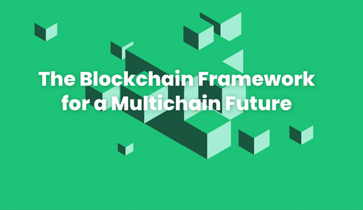
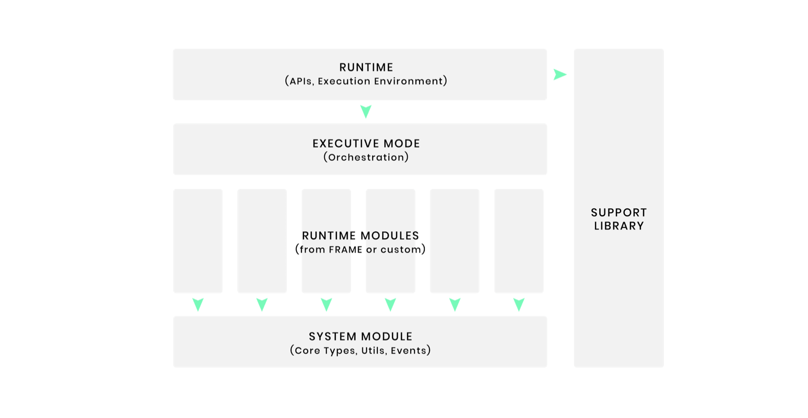
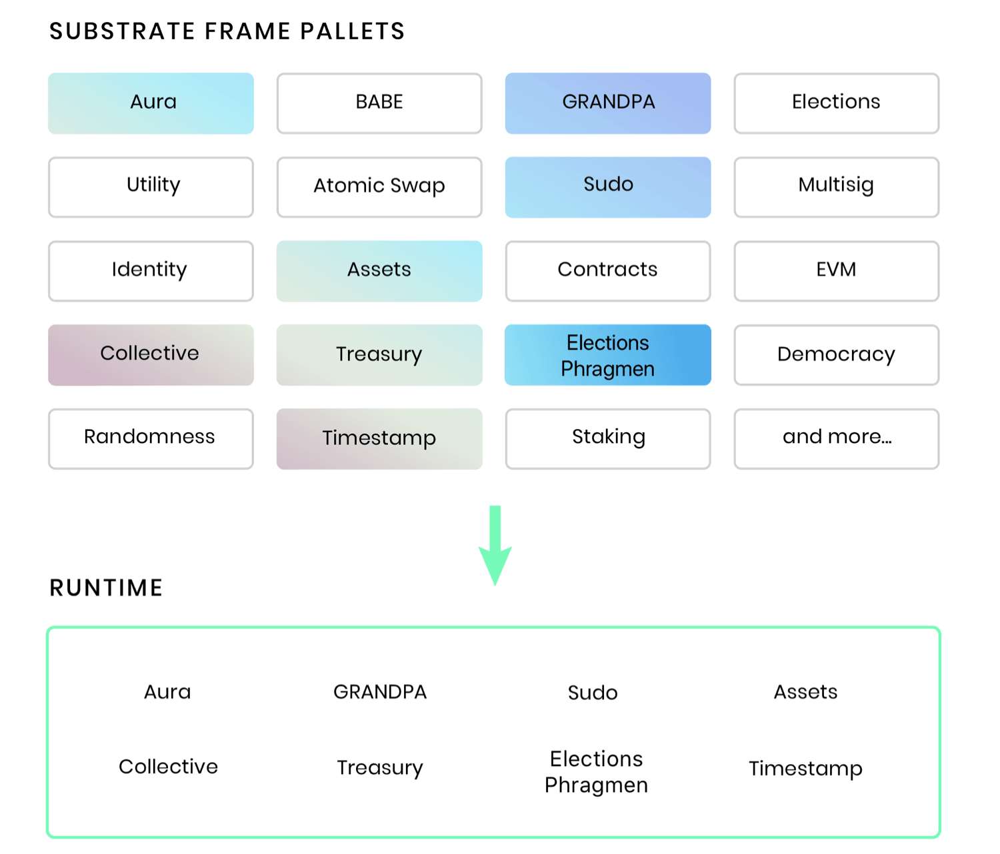

 
  

> Introduction

  **Substrate** is blockchain framework that makes developer build their own blockchain easily. All of the **_Polkadot/Kusama parachains_** are built based on Substrate, which make networks multi-chain platform.

One of the reason that Substrate makes build blockchain flexible is **FRAME**, an acronym for **_Framework for Runtime Aggregation of Modularized Entities_**. Here, we can see there is a word _Aggregation_ meaning there are several modules for Runtime, which called _Pallets_ that are hosting domain-specific logic.

 Here is overall architecture of Substrate Runtime 
 

##### Source: Substrate

  As we can see, Substrate runtime is consist of several modules, which is called **pallet**. **Pallet** contains _types_ for the config for the pallet that are used to logics in pallet, _storage items_ to store the state of blockchain, _functions_ for interacting with chain

 Here are Pallets  
 

  If we want our chain to have certain feature, we can just choose the pallet that is related to the feature. For example, if we want Staking, then we choose Staking pallet. Of course, we can build our own Pallet. This is why Substrate is flexible.

Now, I am going to do Substrate Tutorial called **_Kitties Workshop_**, which is to build full-stack NFT application with our own custom-pallet and some front-end pages

 

> Kitties Workshop
>
> > Custom Pallet

Custom Pallet Tutorial

> > Front-End

Front End Tutorial
