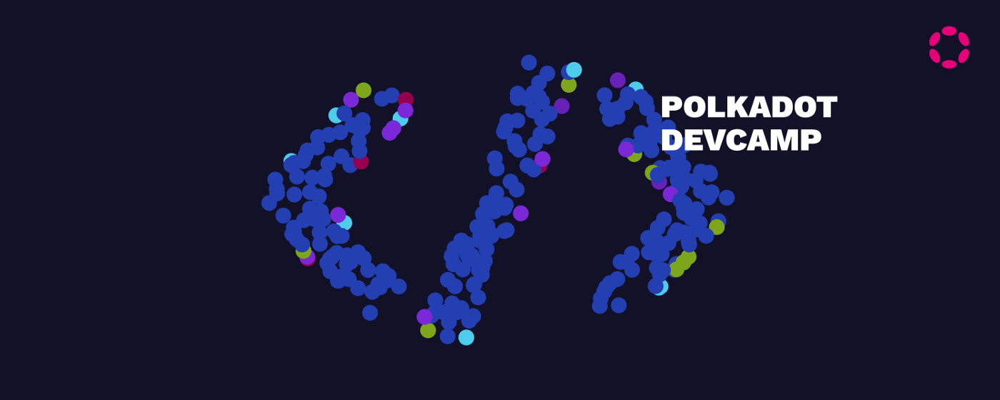

 

 

> **Polkadot Official Dev Camp**
>
> **Bootcamp Period: 5 - 26 May 2022, 8:00 – 11:00pm(GMT +8)**

 

### Lesson 1: Introduction to Substrate and Polkadot

 

### Lesson 2: Key Concept of Substrate and Polkadot

 

### Lesson 3: Creating Substrate Runtime and FRAMD and more

 

### Lesson 4: Building a Blockchain from scratch with Substrate Node

 

### Lesson 5: Substrate in the wild: exploring popular pallets and how they are applied

 

### Lesson 6: Testnets and tooling in Substrate: Polkadot.js, Cumulus, and more

 

### Lesson 7: Developing a full-stack custom Blockchain dApp
